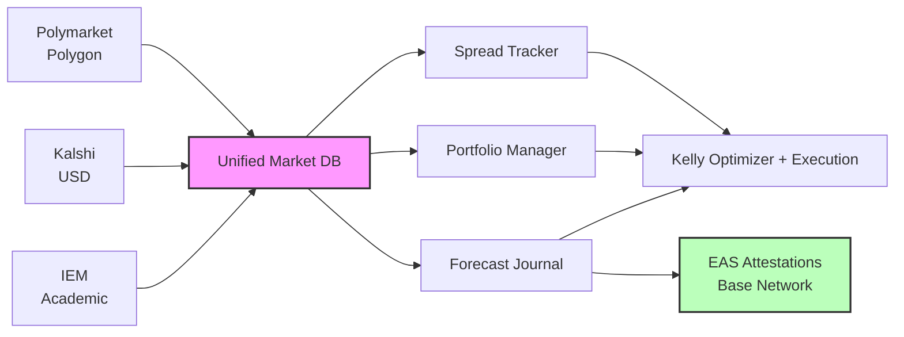
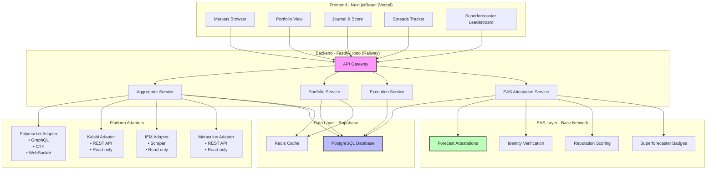
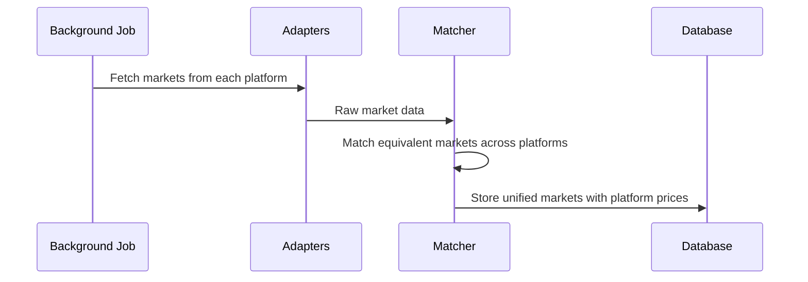
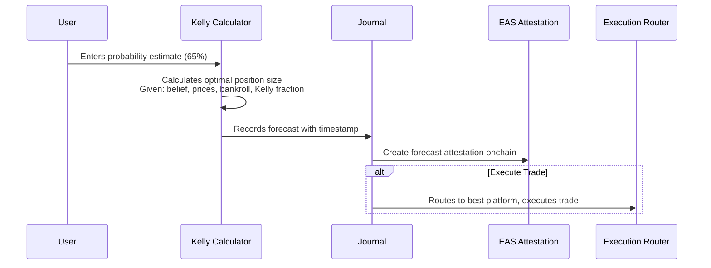
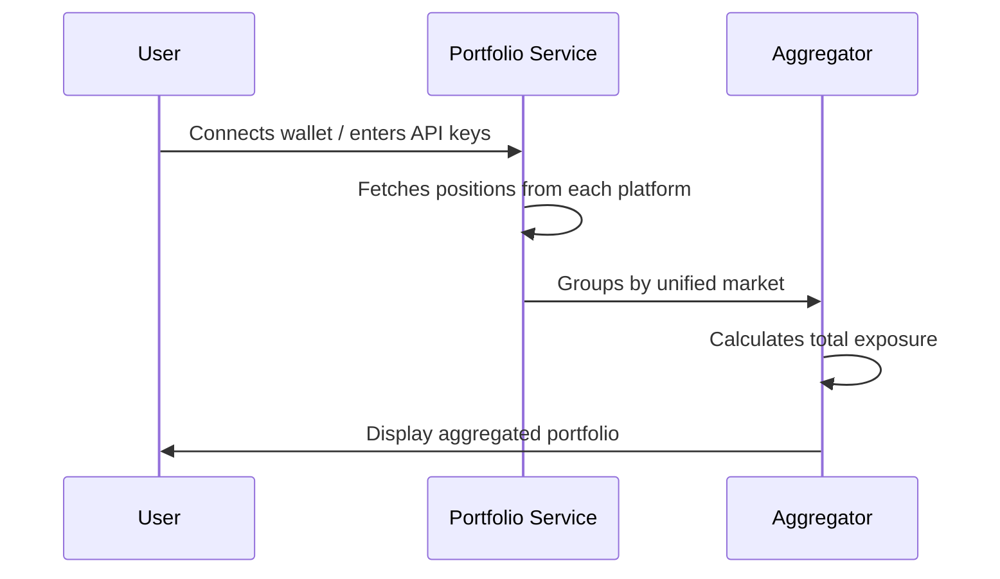
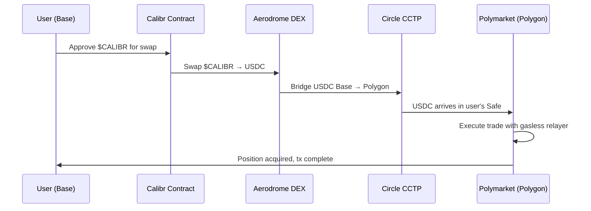
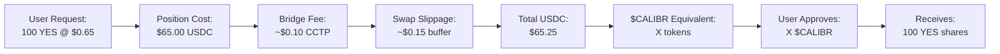
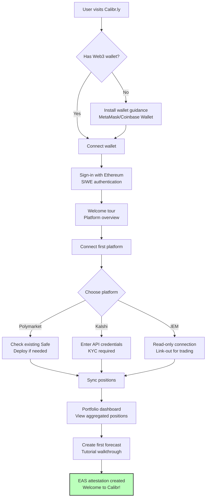
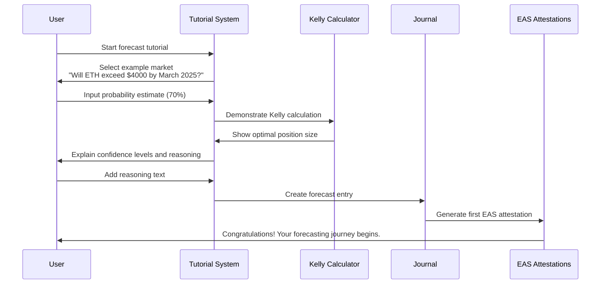

# Calibr.ly Project Requirements

## Prediction Market Portfolio Manager & Aggregation Layer

**Version:** 5.0  
**Last Updated:** January 2026  
**Status:** Planning Phase  
**Token:** $CALIBR (Base L2)

---

## Table of Contents

1. [Executive Summary](#1-executive-summary)
2. [Project Vision](#2-project-vision)
3. [Core Goals](#3-core-goals)
4. [Target Users](#4-target-users)
5. [System Architecture](#5-system-architecture)
6. [Platform Integrations](#6-platform-integrations)
7. [Cross-Chain Architecture](#7-cross-chain-architecture-base--polygon)
8. [Core Features](#8-core-features)
9. [Technical Constraints](#9-technical-constraints)
10. [Non-Goals](#10-non-goals)
11. [Success Metrics](#11-success-metrics)
12. [Development Roadmap](#12-development-roadmap)
13. [User Onboarding Flow](#13-user-onboarding-flow)
14. [NPM Dependencies & Priority Categories](#14-npm-dependencies--priority-categories)

---

## 1. Executive Summary

Calibr.ly is a **prediction market portfolio manager and aggregation layer** that sits on top of existing prediction markets (Polymarket, Kalshi, IEM, etc.). Rather than competing for liquidity by building another prediction market, Calibr provides sophisticated tooling for serious forecasters:

- **Unified view** of markets across multiple platforms
- **Spread tracking** and arbitrage opportunity detection
- **Kelly Criterion optimization** for position sizing
- **Tetlock-style forecast journaling** with time-weighted Brier scoring
- **Smart execution routing** to best available prices

Think of it as **Bloomberg Terminal for prediction markets**.

---

## 2. Project Vision

### 2.1 The Problem

Serious forecasters face several challenges:

1. **Fragmented Markets**: Same events traded on Polymarket, Kalshi, IEM with different prices
2. **No Portfolio View**: Hard to track positions across platforms
3. **Suboptimal Sizing**: Most bettors don't use Kelly Criterion or proper position sizing
4. **No Calibration Tracking**: No way to measure forecasting skill over time
5. **Hidden Mechanics**: CTF (Conditional Token Framework) complexity hidden from users

### 2.2 The Solution

Calibr provides unified forecasting infrastructure with EAS-powered identity system:



### 2.3 Positioning

| Existing Solutions | Calibr Differentiator |
|--------------------|-------------------------|
| Polymarket | Single platform, no Kelly, no journaling |
| Kalshi | Single platform, USD-only, limited API |
| Metaculus | No real money, reputation only |
| Manifold | Play money |
| **Calibr** | Multi-platform aggregation + professional tools + EAS identity |

---

## 3. Core Goals

### 3.1 Primary Goals

| ID | Goal | Description | Priority |
|----|------|-------------|----------|
| G1 | **Multi-Platform Aggregation** | Unified view of markets across Polymarket, Kalshi, IEM | P0 |
| G2 | **Portfolio Management** | Track positions, P&L, exposure across platforms | P0 |
| G3 | **Kelly Optimization** | Calculate optimal position sizes given beliefs vs. prices | P0 |
| G4 | **Forecast Journaling** | Tetlock-style belief tracking with time-weighted scoring | P0 |
| G5 | **EAS Identity Integration** | Cross-platform reputation and verifiable forecasting credentials | P0 |
| G6 | **Spread Detection** | Identify price discrepancies across platforms | P1 |
| G7 | **Execution Routing** | Trade on best platform for each market | P1 |

### 3.2 Secondary Goals

| ID | Goal | Description | Priority |
|----|------|-------------|----------|
| G8 | Unit Portfolio Transparency | Explain CTF mechanics to users | P2 |
| G9 | Calibration Visualization | Show user's calibration curves | P2 |
| G10 | Superforecaster Leaderboards | Rank users by forecast accuracy with EAS badges | P2 |
| G11 | Alerts | Notify on spread opportunities, position changes | P2 |

### 3.3 Design Principles

1. **Aggregation over Competition**: Don't build markets, aggregate them
2. **Fee Transparency**: Clear breakdown of all costs (swap fees, bridge fees, execution costs)
3. **Cross-Chain Optimization**: Seamless Base ↔ Polygon user experience  
4. **Transparency**: Show underlying mechanics (CTF, order books, fees)
5. **Scientific Rigor**: Proper scoring rules, calibration tracking
6. **Hardcore Users First**: Optimize for serious forecasters, not newcomers
7. **ASCII Aesthetic**: Old-school terminal interface (detailed in separate UI spec)
8. **EAS-First Identity**: All forecasting activity generates onchain attestations

---

## 4. Target Users

### 4.1 Primary Persona: The Serious Forecaster

- **Background**: Follows Tetlock, understands probability, has traded on prediction markets
- **Pain Points**: 
  - Tracks positions in spreadsheets
  - Manually checks multiple platforms for best prices
  - No way to measure calibration over time
  - No verifiable forecasting credentials
- **Goals**:
  - Professional-grade portfolio management
  - Systematic approach to sizing and tracking
  - Build track record of forecasting skill
  - Earn recognition as verified superforecaster

### 4.2 Secondary Persona: The Arbitrageur

- **Background**: Quantitative trader, looking for mispricings
- **Pain Points**:
  - Manual spread monitoring is tedious
  - Cross-platform execution is complex
- **Goals**:
  - Real-time spread alerts
  - One-click arbitrage execution (where possible)

### 4.3 Tertiary Persona: The Researcher

- **Background**: Academic studying prediction markets
- **Pain Points**:
  - Hard to get unified data across platforms
  - No good calibration datasets
- **Goals**:
  - Historical data access
  - Aggregated market comparison

---

## 5. System Architecture

### 5.1 High-Level Architecture



### 5.2 Data Flow

**Market Sync Flow (Background Job - Every 30s):**


**User Forecast Flow:**


**Position Sync Flow:**


### 5.3 Component Responsibilities

| Component | Responsibility |
|-----------|----------------|
| **Frontend** | User interface, state management, wallet connection |
| **API Gateway** | Request routing, authentication, rate limiting |
| **Aggregator Service** | Market syncing, matching, unified market maintenance |
| **Portfolio Service** | Position tracking, P&L calculation, exposure analysis |
| **Execution Service** | Trade routing, CTF interactions, order management |
| **Forecast Service** | Journal CRUD, scoring, calibration calculation |
| **Spread Service** | Spread detection, arbitrage opportunities, alerts |
| **EAS Attestation Service** | Onchain identity, reputation, and credential management |

---

## 6. Platform Integrations

### 6.1 Polymarket (Primary Trading Platform)

**Read Access:**
- **Gamma API**: Markets, events, tags, categories
- **CLOB API**: Order books, prices, trade history
- **WebSocket**: Real-time price feeds
- **GraphQL**: Advanced market querying

**Write Access (Builder Program):**
- **Authentication**: HMAC-based API credentials
- **Order Management**: Limit orders, market orders, cancellations
- **Position Management**: CTF operations (mint, merge, redeem)
- **Gasless Trading**: RelayClient for zero-fee transactions

### 6.2 Kalshi

**Read Access:**
- **REST API**: Markets, prices, user positions
- **WebSocket**: Real-time price updates (limited)

**Write Access:**
- **API Keys**: User-generated credentials
- **Order Placement**: Via API or link-out to platform
- **KYC Required**: Full trading requires verification

### 6.3 Iowa Electronic Markets (IEM)

**Read Access:**
- **HTML Scraping**: Market prices, contract details
- **Manual Data Entry**: Market definitions and outcomes

**Write Access:**
- **Link-out Only**: Direct users to IEM for trading

### 6.4 Metaculus (Reference Data)

**Read Access:**
- **REST API**: Questions, forecasts, resolution data
- **Community Predictions**: Aggregate probabilities

**Write Access:**
- **None**: Read-only integration for reference

---

## 7. Cross-Chain Architecture: Base → Polygon

### 7.1 Overview

Users hold $CALIBR tokens on Base L2. To trade on Polymarket (Polygon), we facilitate:

1. **$CALIBR → USDC swap** on Base (via Aerodrome DEX)
2. **USDC bridge** Base → Polygon (via Circle CCTP)
3. **USDC → Position** on Polymarket (via Builder Relayer)

### 7.2 Cross-Chain Flow



### 7.3 Technical Implementation

**Base Layer Smart Contracts:**
```solidity
contract CalibrExecutionRouter {
    // Swap $CALIBR → USDC via Aerodrome
    function swapToUSDC(uint256 calibrAmount) external;
    
    // Bridge USDC to Polygon via CCTP
    function bridgeToPolygon(uint256 usdcAmount, address recipient) external;
    
    // Combined: swap + bridge + execute
    function executePolygonTrade(
        uint256 calibrAmount,
        bytes calldata tradeData
    ) external;
}
```

**Polymarket Integration:**
```typescript
import { RelayClient } from "@polymarket/builder-relayer-client";
import { ClobClient } from "@polymarket/clob-client";

// Initialize gasless relayer
const relayClient = new RelayClient(
  "https://relayer-v2.polymarket.com/",
  137, // Polygon
  walletClient,
  builderConfig
);

// Execute trade through user's Safe
const clobClient = new ClobClient(
  "https://clob.polymarket.com",
  137,
  ethersSigner,
  userApiCredentials,
  2, // signatureType = 2 for Safe
  userSafeAddress
);
```

### 7.4 Circle CCTP Integration

We use **Circle's Cross-Chain Transfer Protocol (CCTP)** via **Gelato's Gasless SDK** for bridging:

**Why CCTP:**
| Advantage | Description |
|-----------|-------------|
| Native USDC | Burns on Base, mints native USDC on Polygon (not wrapped) |
| 1:1 Transfer | No slippage, no liquidity pool dependency |
| Circle Secured | Verified by Circle's attestation service |
| Fast Transfer | CCTP V2 enables <30 second settlement |
| No Bridge Risk | No third-party bridge contracts holding funds |

**CCTP Technical Flow:**
1. **Sign**: User signs ERC-3009 transfer authorization (off-chain, no gas)
2. **Submit**: Signed message sent to Gelato relay network
3. **Burn**: Gelato executes CCTP burn on Base, deducts relay fee (~$0.10)
4. **Attestation**: Circle's service verifies burn, issues signed attestation
5. **Mint**: Attestation submitted to Polygon, Circle mints native USDC

**Gelato Gasless CCTP SDK:**
```typescript
import { GelatoRelay } from "@gelatonetwork/relay-sdk";

const relay = new GelatoRelay();

// User signs ERC-3009 permit (no gas needed)
const permit = await signERC3009Permit(user, amount, deadline);

// Submit to Gelato for gasless CCTP bridge
const { taskId } = await relay.sponsoredCallERC3009(
  CCTP_CONTRACT,
  permit,
  { chainId: BASE_CHAIN_ID }
);

// Monitor status
const status = await relay.getTaskStatus(taskId);
```

### 7.5 Quote Calculation

When user requests a position, calculate all-in cost:



### 7.6 Account Linking Flow

**For Users WITH Existing Polymarket Account:**
```
1. User connects wallet to Calibr.ly
2. Derive their Polymarket Safe address (deterministic from EOA)
3. Verify: Check if Safe is deployed on Polygon
4. If deployed: Link account, read positions, enable trading
5. User signs Calibr.ly auth (SIWE) - does NOT expose private key
6. All future trades execute through their existing Safe
```

**For Users WITHOUT Polymarket Account:**
```
1. User connects any EVM wallet to Calibr.ly
2. Derive their would-be Safe address
3. On first trade: Deploy Safe via Builder Relayer (gasless)
4. Safe is now usable on BOTH Calibr.ly AND Polymarket.com
5. User has seamless experience across both platforms
```

**Security Model:**
- ❌ Never request private keys
- ❌ Never custody user funds
- ✅ User signs transaction intents only
- ✅ Builder credentials stay server-side
- ✅ All trades execute through user's own Safe

---

## 8. Core Features

### 8.1 Market Aggregation

**Description:** Unified view of prediction markets across platforms

**Requirements:**
- F1.1: Fetch markets from all integrated platforms
- F1.2: Match equivalent markets using NLP similarity + manual curation
- F1.3: Display unified market with prices from all platforms
- F1.4: Calculate and display spread between platforms
- F1.5: Show best buy/sell price and platform
- F1.6: Real-time price updates (where available)

**Matching Algorithm:**
```
1. Extract key entities from market question (NLP)
2. Compare entity overlap + semantic similarity
3. Flag potential matches for manual review
4. Store confirmed matches in database
5. Handle multi-outcome markets (map outcomes across platforms)
```

### 8.2 Portfolio Management

**Description:** Track positions and P&L across platforms

**Requirements:**
- F2.1: Connect wallet (Polymarket/EVM)
- F2.2: Enter API credentials (Kalshi)
- F2.3: Fetch positions from each platform
- F2.4: Aggregate positions by unified market
- F2.5: Calculate unrealized P&L per position
- F2.6: Calculate total portfolio value and exposure
- F2.7: Show correlated exposures (e.g., Trump + GOP)
- F2.8: Historical P&L tracking

### 8.3 Kelly Criterion Optimizer

**Description:** Calculate optimal position size given beliefs

**Requirements:**
- F3.1: User inputs probability estimate (1-99%)
- F3.2: User selects Kelly fraction (25%, 50%, 75%, 100%)
- F3.3: Calculate full Kelly: `f* = (p*b - q) / b`
- F3.4: Apply Kelly fraction multiplier
- F3.5: Show recommended bet size in dollars
- F3.6: Show expected growth rate
- F3.7: Compare to current position, show rebalance action
- F3.8: Account for existing exposure in calculation

### 8.4 Forecast Journal with EAS Integration

**Description:** Tetlock-style belief tracking with onchain attestations

**Requirements:**
- F4.1: Record forecast with probability, timestamp, rationale
- F4.2: Create EAS attestation for each forecast (onchain)
- F4.3: Allow updates with new probability (belief change)
- F4.4: Store commit message explaining update
- F4.5: Calculate time-weighted Brier score after resolution
- F4.6: Update calibration score attestations periodically
- F4.7: "Forecast Only" mode (log belief without trading)
- F4.8: "Commit & Rebalance" mode (log + execute)
- F4.9: Display commit history (git-style)
- F4.10: Link to EAS attestation UID and transaction hash
- F4.11: Calibration curve visualization

**Scoring Formula:**
```
Time-Weighted Brier = Σ (Brier_i × Duration_i) / Total Duration

Where:
  Brier_i = (probability_i - outcome)²
  Duration_i = time until next update or resolution
```

**EAS Schema Integration:**
```typescript
// Forecast Attestation Schema
"uint256 probability,string marketId,string platform,uint256 confidence,string reasoning,bool isPublic"

// Calibration Score Attestation Schema  
"uint256 brierScore,uint256 totalForecasts,uint256 timeWeightedScore,uint256 period,string category"
```

### 8.5 Spread Tracker

**Description:** Identify arbitrage opportunities

**Requirements:**
- F5.1: Monitor prices across platforms for matched markets
- F5.2: Calculate spread: `bestSell - bestBuy`
- F5.3: Flag spreads above threshold (configurable, default 1%)
- F5.4: Calculate potential profit after fees
- F5.5: Estimate execution complexity (same chain, cross-chain, requires KYC)
- F5.6: Optional alerts (email, push, webhook)
- F5.7: Historical spread data

### 8.6 Execution Router

**Description:** Trade on best available platform

**Requirements:**
- F6.1: Given order, find best execution venue
- F6.2: For Polymarket: Execute via CTF + CLOB
- F6.3: For Kalshi: Link out to platform (if no API access)
- F6.4: Handle slippage protection
- F6.5: Support limit orders (where available)
- F6.6: Transaction status tracking
- F6.7: Retry logic for failed transactions

### 8.7 Superforecaster System with EAS

**Description:** Recognition and leaderboard system

**Requirements:**
- F7.1: Calculate composite reputation score (Calibr + external platforms)
- F7.2: Assign superforecaster tiers (Apprentice → Grandmaster)
- F7.3: Mint achievement badges as NFTs via EAS
- F7.4: Cross-platform reputation import (Optimism, Coinbase, Gitcoin)
- F7.5: Public leaderboards with filtering/sorting
- F7.6: Celebration mechanics for tier promotions
- F7.7: Achievement streak tracking
- F7.8: Hall of fame for top performers

---

## 9. Technical Constraints

### 9.1 Platform Constraints

| Constraint | Description | Mitigation |
|------------|-------------|------------|
| Polymarket rate limits | 100 req/min for GraphQL | Cache aggressively, batch requests |
| Kalshi auth | Requires KYC for trading | Read-only + link out for most users |
| IEM no API | Must scrape HTML | Cache heavily, handle scrape failures |
| Cross-chain latency | CCTP bridge takes ~30 seconds | Show pending state, async confirmation |

### 9.2 Technical Stack Constraints

| Component | Technology Choice | Rationale |
|-----------|------------------|-----------|
| **Frontend** | Next.js/React (Vercel) | Modern React framework, excellent Vercel integration |
| **Backend** | Fastify + Hono (Railway) | Fast Node.js frameworks, Railway for easy deployment |
| **Database** | Supabase (PostgreSQL) | Managed PostgreSQL with real-time features |
| **Cache** | Redis (via Supabase/Railway) | Fast caching for market data and user sessions |
| **Base Chain** | Base L2 | $CALIBR token, Paymaster for gasless transactions |
| **Trading Chain** | Polygon PoS | Polymarket integration via Builder Relayer |
| **Bridge** | Circle CCTP | Native USDC, no wrapped tokens |
| **Real-time Updates** | WebSocket + polling fallback | Price updates every few seconds |
| **Auth** | Wallet-based (SIWE) | Multiple platforms, wallet integration |

### 9.3 Cross-Chain Constraints

| Constraint | Description | Mitigation |
|------------|-------------|------------|
| Bridge latency | CCTP takes ~30 seconds | Async execution, status polling |
| Gas on destination | Polygon needs POL for gas | Use Builder Relayer (gasless) |
| Slippage | $CALIBR→USDC swap has price impact | Buffer in quote, MEV protection |
| Bridge failures | CCTP attestation may delay | Retry logic, fallback bridges |

### 9.4 Regulatory Constraints

| Constraint | Description | Mitigation |
|------------|-------------|------------|
| Geographic restrictions | Some platforms have regional limits | Geo-detection with user disclaimer |
| Kalshi US-only | Kalshi only available to US users | Show appropriate platform per region |
| Not financial advice | Cannot provide investment advice | Clear disclaimers, educational framing |

**User Disclaimer:**
> "By using this platform, you affirm you are not a citizen or resident of countries where prediction market trading is prohibited. This platform is for educational and informational purposes only and does not constitute financial advice."

*Note: Polymarket is now available to US users as of 2024, removing previous geographic restrictions.*

### 9.5 Performance Requirements

| Metric | Requirement |
|--------|-------------|
| Market sync latency | < 30 seconds from source |
| API response time | < 200ms for cached data |
| Trade execution | < 5 seconds for Polymarket |
| Concurrent users | Support 1000 concurrent |
| Data retention | 2 years of historical data |

---

## 10. Non-Goals

The following are explicitly **out of scope** for Calibr:

| Non-Goal | Rationale |
|----------|-----------|
| Create our own prediction markets | Would require bootstrapping liquidity; aggregate instead |
| Compete with Polymarket/Kalshi | Complement, don't compete |
| Mobile app (initially) | Web-first focus; web3 social miniapp secondary |
| Social features (comments, follows) | Focus on tools, not social |
| Market creation tools | Users create markets on source platforms |
| Custodial wallet | Users bring their own wallets |
| Fiat on-ramp | Users fund on source platforms |

---

## 11. Success Metrics

### 11.1 User Metrics

| Metric | Target (6 months) |
|--------|-------------------|
| Registered users | 5,000 |
| Monthly active users | 1,000 |
| Forecasts logged | 50,000 |
| EAS attestations created | 100,000 |
| Portfolios connected | 2,000 |

### 11.2 Engagement Metrics

| Metric | Target |
|--------|--------|
| Avg forecasts per active user per month | 10 |
| Portfolio check-ins per user per week | 3 |
| Kelly calculator usage | 50% of forecasts |
| Rebalance execution rate | 30% of forecasts |
| Superforecaster tier progressions | 500/quarter |

### 11.3 Quality Metrics

| Metric | Target |
|--------|--------|
| Market match accuracy | > 95% |
| Price sync latency | < 30 seconds |
| Trade execution success rate | > 99% |
| Uptime | > 99.5% |
| EAS attestation success rate | > 99% |

### 11.4 Business Metrics

| Metric | Target |
|--------|--------|
| Trading volume routed | $1M / month |
| Cross-chain transactions | 10,000 / month |
| $CALIBR token utility usage | 80% of trades |
| Cost per user | < $0.50 / month |

---

## 12. Development Roadmap

### 12.1 Polymarket Integration Strategy

Development is sequenced to minimize complexity and dependencies:

```mermaid
gantt
    title Polymarket Integration Phases
    dateFormat  X
    axisFormat  %s
    
    section Phase 1: Market Data
    Gamma API            :a1, 0, 2w
    CLOB read-only       :a2, after a1, 1w
    WebSocket feeds      :a3, after a2, 1w
    
    section Phase 2: Builder Program  
    Auth setup           :b1, after a3, 1w
    HMAC signing         :b2, after b1, 1w
    Order attribution    :b3, after b2, 1w
    
    section Phase 3: Gasless Trading
    RelayClient setup    :c1, after b3, 1w
    Safe deployment      :c2, after c1, 1w
    CTF operations       :c3, after c2, 1w
    
    section Phase 4: Order Execution
    L1→L2 auth flow      :d1, after c3, 1w
    Order management     :d2, after d1, 2w
    Status tracking      :d3, after d2, 1w
```



### 12.2 Key Documentation References

- **Polymarket Docs**: https://docs.polymarket.com/
- **Gamma API**: https://docs.polymarket.com/developers/gamma-markets-api
- **CLOB API**: https://docs.polymarket.com/developers/CLOB
- **Builder Program**: https://docs.polymarket.com/developers/builders
- **RelayClient**: https://docs.polymarket.com/developers/builders/relayer-client
- **Circle CCTP**: https://developers.circle.com/stablecoin/docs/cctp-getting-started
- **EAS Documentation**: https://docs.attest.org/

---

## 13. User Onboarding Flow

### 13.1 New User Journey



### 13.2 Platform Connection Flows

**Polymarket Connection:**
1. **Wallet Detection**: Check if user's EOA has associated Safe
2. **Safe Deployment**: If no Safe exists, deploy via RelayClient (gasless)
3. **Position Sync**: Fetch existing positions via GraphQL
4. **Trading Ready**: User can now forecast and execute trades

**Kalshi Connection:**
1. **API Setup**: Guide user to create API credentials at kalshi.com
2. **KYC Check**: Verify account status and trading permissions
3. **Credential Storage**: Securely store encrypted API keys
4. **Position Sync**: Fetch positions via REST API

**Iowa Electronic Markets:**
1. **Information Only**: Explain IEM integration is read-only
2. **Price Display**: Show IEM prices for comparison
3. **Link-out Trading**: Direct users to IEM for actual trading

### 13.3 First Forecast Tutorial



### 13.4 Onboarding Success Metrics

| Metric | Target | Measurement |
|--------|--------|-------------|
| Wallet connection rate | > 80% | Users who complete wallet connection |
| Platform integration rate | > 60% | Users who connect at least one platform |
| First forecast rate | > 40% | Users who create their first forecast |
| 7-day retention | > 30% | Users who return within a week |
| EAS attestation creation | > 95% | Success rate of first attestation |

---

## 14. NPM Dependencies & Priority Categories

### 14.1 Core NPM Dependencies

**Polymarket Integration:**
```json
{
  "@polymarket/clob-client": "^5.2.1",
  "@polymarket/builder-signing-sdk": "^0.0.8", 
  "@polymarket/order-utils": "^3.0.1",
  "@polymarket/real-time-data-client": "^1.4.0"
}
```

**Frontend Stack:**
```json
{
  "next": "^14.0.0",
  "react": "^18.0.0",
  "typescript": "^5.0.0",
  "@rainbow-me/rainbowkit": "^1.3.0",
  "wagmi": "^1.4.0",
  "viem": "^1.19.0"
}
```

**Backend Framework:**
```json
{
  "fastify": "^4.24.0",
  "hono": "^3.11.0",
  "@supabase/supabase-js": "^2.38.0",
  "redis": "^4.6.0"
}
```

**EAS Integration:**
```json
{
  "@ethereum-attestation-service/eas-sdk": "^1.4.0",
  "@ethereum-attestation-service/eas-contracts": "^1.3.0"
}
```

**Cross-Chain & DeFi:**
```json
{
  "@gelatonetwork/relay-sdk": "^5.5.0",
  "@circle-fin/cctp-sdk": "^1.0.0",
  "ethers": "^5.7.1",
  "@ethersproject/providers": "^5.7.2"
}
```

### 14.2 Priority Categories Storage

**Database Schema (Supabase PostgreSQL):**
```sql
-- Priority categories for market classification
CREATE TABLE priority_categories (
  id UUID PRIMARY KEY DEFAULT gen_random_uuid(),
  name VARCHAR(100) NOT NULL,
  slug VARCHAR(100) UNIQUE NOT NULL,
  description TEXT,
  priority_level INTEGER NOT NULL, -- 0=P0, 1=P1, 2=P2
  color_hex VARCHAR(7),
  icon_name VARCHAR(50),
  created_at TIMESTAMP WITH TIME ZONE DEFAULT NOW(),
  updated_at TIMESTAMP WITH TIME ZONE DEFAULT NOW()
);

-- Market category assignments
CREATE TABLE market_categories (
  id UUID PRIMARY KEY DEFAULT gen_random_uuid(),
  unified_market_id UUID REFERENCES unified_markets(id),
  category_id UUID REFERENCES priority_categories(id),
  assigned_at TIMESTAMP WITH TIME ZONE DEFAULT NOW(),
  assigned_by UUID REFERENCES users(id),
  confidence_score DECIMAL(3,2) -- 0.00-1.00 for ML classification confidence
);

-- Initial priority categories
INSERT INTO priority_categories (name, slug, priority_level, color_hex) VALUES
('Politics', 'politics', 0, '#ff4444'),
('Crypto', 'crypto', 0, '#ff8800'), 
('Sports', 'sports', 1, '#00aa00'),
('Economics', 'economics', 0, '#0066ff'),
('Technology', 'technology', 1, '#8800ff'),
('Climate', 'climate', 1, '#00ffff'),
('Entertainment', 'entertainment', 2, '#ffff00');
```

**Redis Caching Strategy:**
```typescript
// Cache category assignments for fast lookup
interface CategoryCache {
  marketId: string;
  categories: {
    id: string;
    name: string;
    priority: number;
    confidence: number;
  }[];
  lastUpdated: number;
}

// Cache keys
const CATEGORY_CACHE_KEY = (marketId: string) => `market:${marketId}:categories`;
const CATEGORY_LIST_KEY = "categories:all";
const TTL_HOURS = 24;
```

**Category Assignment Logic:**
1. **Automated Classification**: NLP analysis of market questions
2. **Manual Curation**: Admin review and assignment
3. **User Feedback**: Community-driven category suggestions
4. **Machine Learning**: Training models on existing classifications
5. **Cache Strategy**: Redis for fast category lookup with 24-hour TTL

This approach ensures categories are stored persistently in Supabase while maintaining fast access through Redis caching, supporting both automated and manual category management workflows.

---

*This document represents the complete technical specification for Calibr.ly's prediction market aggregation platform with EAS-integrated identity infrastructure.*  
*Version 5.0 | January 2026*
